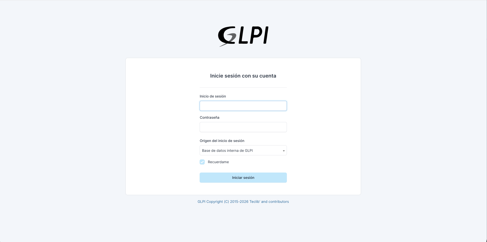
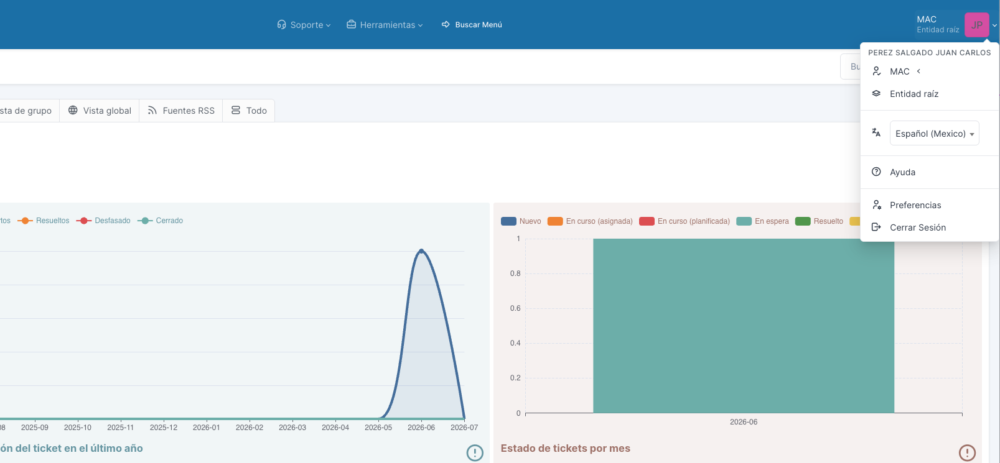
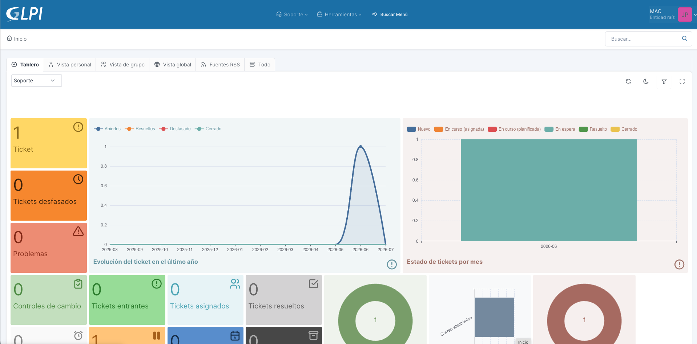
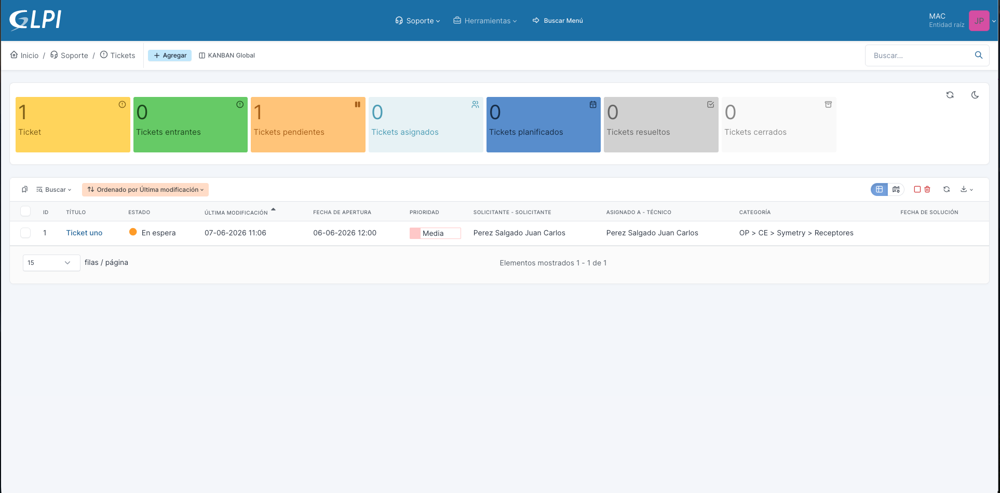

# Parte 2. Primeros pasos
 
**Manual de Uso de GLPI para Agentes de Mesa de Ayuda**
Trantor Technologies | Service Desk
 
---
 
## 2.1 Acceso al sistema
 
### Punto de acceso
 
El ingreso a GLPI se realiza desde el navegador web, a través de la siguiente dirección:
 
`https://helpdesk.trantortechnologies.mx`
 
Se recomienda guardar esta dirección en favoritos, ya que es el punto de entrada único a la operación diaria.
 
### Método de inicio de sesión
 
El acceso se realiza mediante **cuenta local de GLPI**. Cada agente cuenta con un usuario y una contraseña propios, administrados directamente en la plataforma. No se utiliza inicio de sesión con cuentas de dominio, correo corporativo ni proveedores externos.
 
Pasos para iniciar sesión:
 
1. Abrir la dirección de acceso en el navegador.
2. Capturar el nombre de usuario asignado.
3. Capturar la contraseña.
4. Confirmar el ingreso.

 
Cada agente debe usar únicamente su propia cuenta. Compartir credenciales rompe la trazabilidad de los tickets y no está permitido, ya que impide saber quién realizó cada acción.
 
### Política de contraseñas y segundo factor
 
Actualmente **no está activada** una política de complejidad de contraseñas ni un segundo factor de autenticación (MFA). Aun así, cada agente es responsable del resguardo de sus credenciales y de no compartirlas.
 
> Buena práctica: usar una contraseña que no se reutilice en otros sistemas y cerrar la sesión al terminar el turno, sobre todo en equipos compartidos.
 
### Recuperación de acceso y soporte
 
Si un agente olvida su contraseña, pierde el acceso o presenta cualquier problema para ingresar, debe solicitar el restablecimiento directamente con el responsable del área.
 
Contacto para problemas de acceso:
 
- **Responsable:** Juan Carlos Pérez Salgado
- **Área:** Gerencia de Service Desk / Sistemas
- **Correo:** jperez@trantortechnologies.mx
- **Medio:** correo electrónico
El agente no puede restablecer su acceso por autoservicio; el restablecimiento lo realiza el administrador de la plataforma.
 
---
 
## 2.2 La interfaz de GLPI
 
Esta sección describe el entorno de trabajo del agente en GLPI versión 11. Las pantallas pueden variar ligeramente según la configuración; las capturas de esta sección corresponden a la instancia de Trantor Technologies.
 
### Perfil del agente
 
Los agentes de mesa de ayuda operan con el perfil **MAC**. El perfil define qué puede ver y hacer cada usuario dentro de GLPI. El perfil MAC está orientado a la atención de tickets, por lo que el agente trabaja de forma enfocada en la operación de soporte sin exponerse a módulos administrativos que no le corresponden.
 
Si al ingresar el agente no ve las opciones esperadas, lo primero a verificar es que esté operando con el perfil correcto. El perfil activo se muestra y se puede cambiar (cuando el usuario tiene más de uno) en la parte superior de la pantalla.
 

 
### Alcance de la vista del agente
 
Con el perfil MAC, el agente accede únicamente al **módulo de Asistencia**, que es donde vive la gestión de tickets. No tiene acceso a los módulos de Inventario, Activos ni Administración.
 
Esto es intencional: mantiene la interfaz simple y centrada en lo que el agente necesita para atender usuarios, y evita cambios accidentales en áreas sensibles de la plataforma.
 
### Vista general de la pantalla
 
Al iniciar sesión, el agente llega a la pantalla principal o central. Los elementos que debe reconocer son:
 
- **Menú de navegación:** da acceso a las secciones del módulo de Asistencia (tickets y demás vistas disponibles para el perfil).
- **Pantalla central (tablero):** muestra un resumen del estado de los tickets, con contadores y accesos rápidos. Es el punto de partida del turno.
- **Buscador:** permite localizar tickets por número, contenido u otros criterios.
- **Barra superior:** muestra el usuario, el perfil activo y la opción de cerrar sesión.

 
### Navegación básica
 
- Desde el menú se accede a la lista de tickets para consultar, filtrar y abrir casos.
- Desde la pantalla central se aprovechan los contadores para saltar directo a los tickets que requieren atención (por ejemplo, los nuevos o los asignados al agente).
- El buscador es la vía más rápida cuando ya se conoce el número de ticket.
> Buena práctica: iniciar cada turno revisando la pantalla central antes de tomar tickets. Da una lectura rápida de la carga de trabajo y ayuda a priorizar, en lugar de atender por orden de llegada sin criterio.
 
---
 
## 2.3 Configuración personal
 
### Preferencias gestionadas por el administrador
 
En esta instancia, las preferencias y notificaciones de los agentes **las administra centralmente el responsable de la plataforma**, no el agente. Esto incluye la configuración de qué notificaciones se envían y cómo se comporta la cuenta.
 
El propósito es mantener un comportamiento homogéneo en todo el equipo: que todos reciban las mismas alertas y trabajen bajo la misma configuración, evitando diferencias que compliquen la operación o el soporte.
 
Si un agente considera que necesita un ajuste en sus notificaciones o preferencias, debe solicitarlo al responsable del área (Juan Carlos Pérez Salgado, jperez@trantortechnologies.mx) en lugar de intentar cambiarlo por su cuenta.
 
### Idioma
 
El idioma por defecto de la plataforma es **español**. Todo el manual y la operación asumen este idioma.
 
### Vista de "Mis tickets"
 
Aunque la configuración general la lleva el administrador, el agente sí trabaja de forma cotidiana con su vista de tickets asignados. Esta vista es su lista de trabajo personal: los tickets de los que es responsable y sobre los que debe actuar.
 
Reconocer y usar esta vista es fundamental, ya que es la base de la operación diaria: es donde el agente ve qué le toca atender. El detalle de cómo trabajar los tickets de esta lista se aborda en las Partes 3 y 5.
 

 
---
 
*Fin de la Parte 2. Primeros pasos.*
 