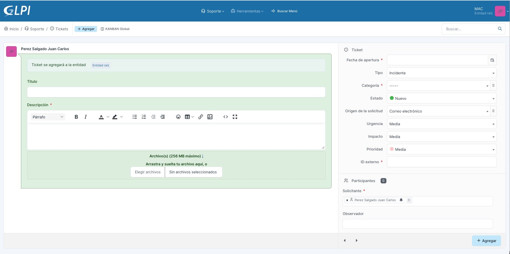
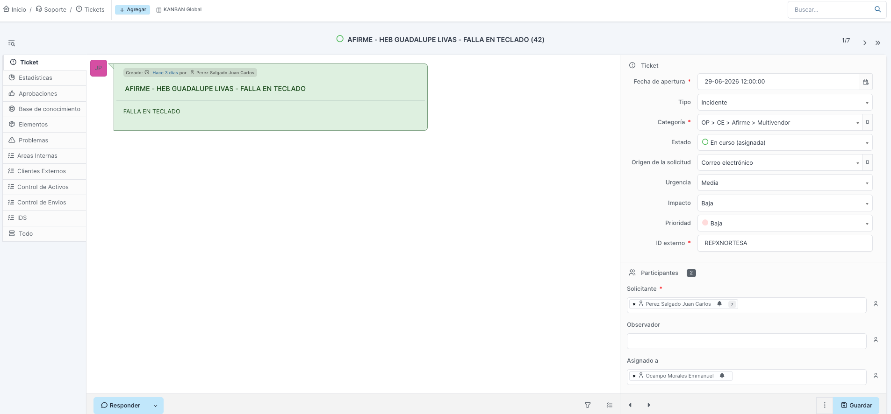
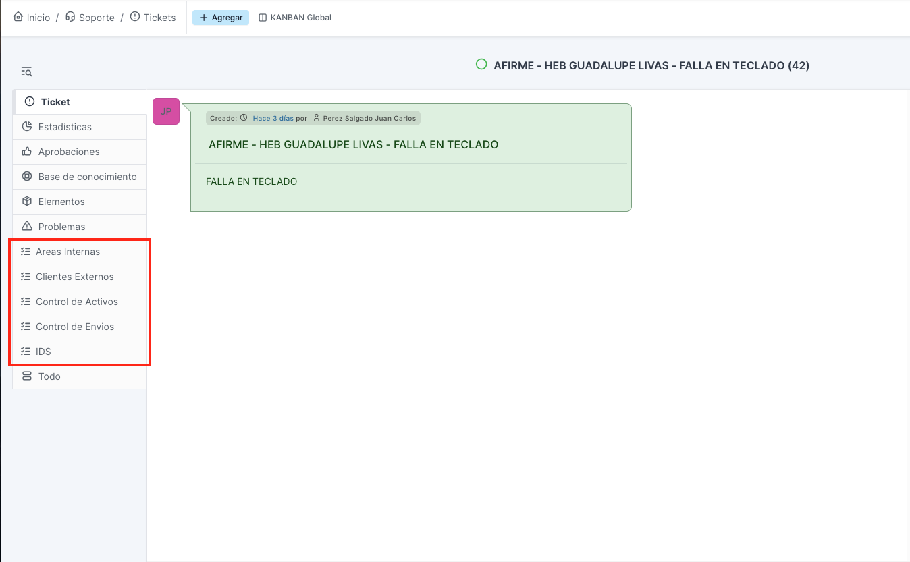
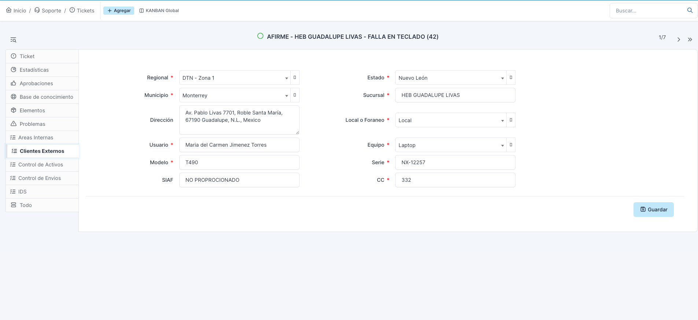
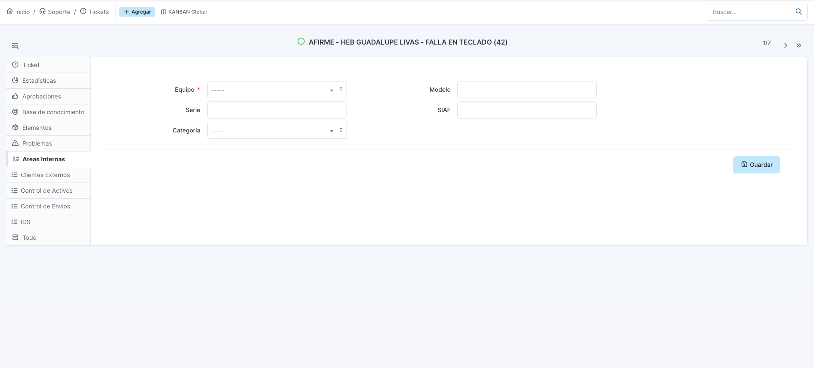
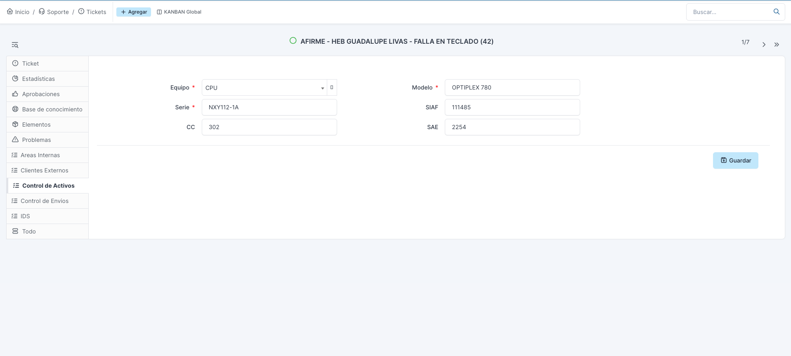
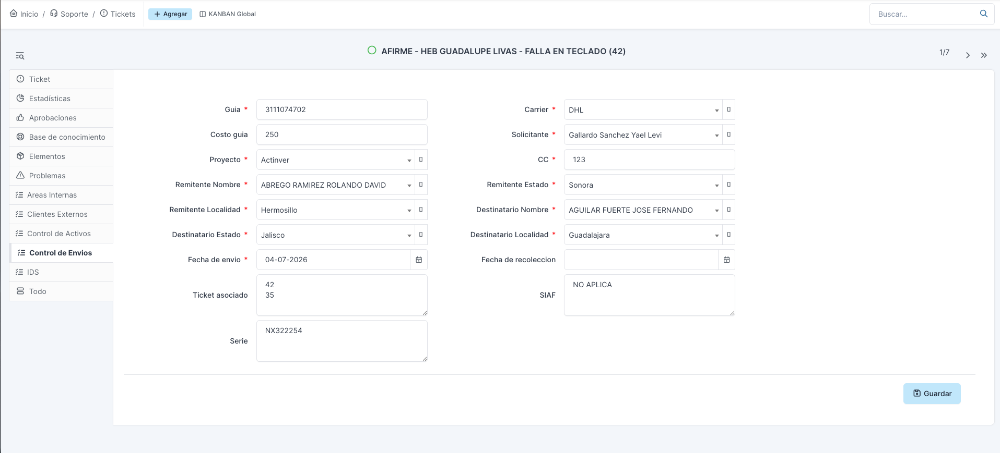
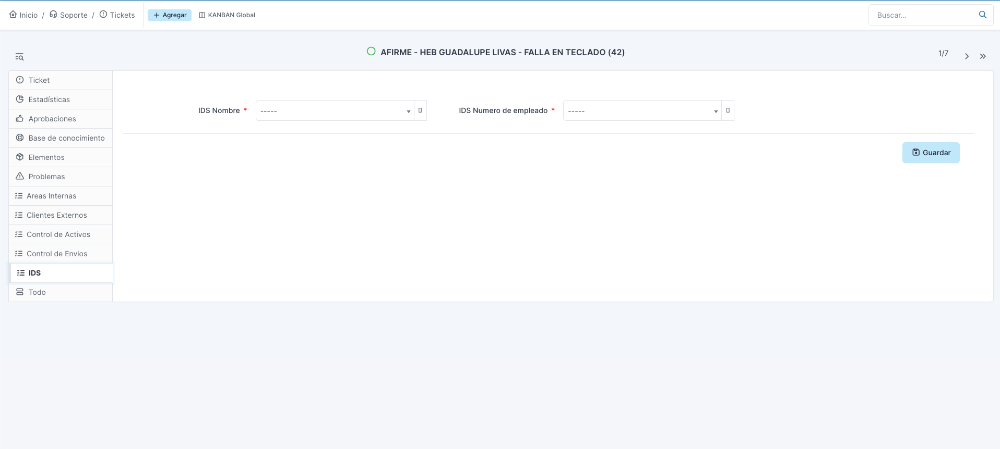

# Parte 3. Gestión de tickets: creación
 
**Manual de Uso de GLPI para Agentes de Mesa de Ayuda**
Trantor Technologies | Service Desk
 
---
 
## 3.1 El rol del agente MAC en el flujo de atención
 
El agente de Mesa de Ayuda Central (MAC) no atiende los tickets en sitio. Su función es registrar, clasificar, asignar y dar seguimiento. La atención técnica la realizan los Ingenieros de Servicio (IDS) en campo, previa asignación del coordinador operativo.
 
El flujo general es:
 
1. Un área o líder de proyecto envía una solicitud (por correo u otro canal).
2. El agente MAC registra el ticket en GLPI, lo clasifica y lo asigna al coordinador operativo correspondiente (o GLPI lo asigna automáticamente según la categoría).
3. El coordinador operativo asigna el ticket a un Ingeniero de Servicio (IDS).
4. El IDS atiende en sitio. Todas las atenciones que gestiona el MAC son soporte en sitio de nivel 2 (N2).
5. El agente MAC da seguimiento hasta que el servicio se restablece y el ticket queda en Resuelto.
Idea clave: el agente MAC es el punto de control y despacho. La calidad del registro y de la clasificación que haga determina que el ticket llegue bien y a tiempo a quien lo resuelve.
 
---
 
## 3.2 Estados del ciclo de vida que usa el agente MAC
 
GLPI tiene configurados siete estados. El agente MAC solo opera cuatro. Los demás no le corresponden en esta fase.
 
| Estado | ¿Lo usa el MAC? | Cuándo aplica |
|---|---|---|
| Nuevo | No | No aplica para el agente MAC en esta fase. |
| Aprobación | No | No forma parte de la operación del agente. |
| En curso (asignada) | Sí | Estado inicial del ticket al recibir la solicitud y registrarla. |
| En curso (planificada) | Sí | Cuando el coordinador ya asignó a un IDS y existe fecha y hora de atención en sitio. |
| En espera | Sí | Cuando el ticket se detiene por refacción, por solicitud del cliente u otra causa externa. |
| Resuelto | Sí | Cuando el servicio quedó restablecido. |
| Cerrado | No | Lo realiza GLPI automáticamente a las 48 horas de estar en Resuelto. El agente nunca cierra a mano. |
 
Regla de operación: el ticket siempre nace en **En curso (asignada)** y el agente nunca lo cierra manualmente. El cierre es automático.
 
---
 
## 3.3 Creación del ticket: campos y cómo llenarlos
 
Para crear un ticket, el agente ingresa a Soporte > Tickets y usa la opción de nuevo ticket. A continuación se detalla cada campo, en el orden en que conviene llenarlo.
 

 
### Título
 
Se captura con una nomenclatura fija, **todo en mayúsculas**, con la siguiente estructura:
 
`NOMBRE DE CLIENTE - SUCURSAL - DESCRIPCIÓN BREVE DE LA SOLICITUD`
 
Ejemplo:
 
`AFIRME - HEB GUADALUPE LIVAS - FALLA EN TECLADO`
 
Un título bien construido permite identificar el caso de un vistazo en las listas y reportes, sin abrir el ticket. Es obligatorio respetar la nomenclatura.
 
**Qué va en el segmento SUCURSAL.** Depende del tipo de caso:
 
- **Clientes externos con sitio físico** (Sellcom, Banorte, Cattri, etc.): se usa el nombre real de la sucursal donde se dará el servicio (ejemplo: `HEB GUADALUPE LIVAS`).
- **Categorías sin sucursal física** (áreas internas, administración y algunas categorías de cliente): se usa una **convención predefinida** por categoría, en lugar de dejar el segmento en blanco. La convención vigente es:
| Categoría | Convención para el segmento SUCURSAL |
|---|---|
| OP > CE > Actinver > Edificios | Actinver Edificio |
| OP > CE > Actinver > Data Center | Actinver Data Center |
| OP > CE > Afirme > Edificios | Afirme Edificio |
| OP > AI > Laboratorio | Laboratorio |
| OP > AI > Sistemas Internos | Sistemas Internos |
| OP > AI > Documentación Interna | Documentación Interna |
| AD > Almacén > Control de Activos | Almacén |
| AD > Servicios Generales > Control de Envíos | Logística |
| AD > Servicios Generales > Servicios Internos | Mantenimiento |
| AD > Tesorería > Viáticos | Tesorería |
| AD > Relaciones Humanas > Personal | RRHH |
 
Regla: cada vez que se dé de alta una categoría nueva sin sucursal física, debe definirse su convención de SUCURSAL y sumarla a esta tabla, para mantener títulos consistentes.
 
### Descripción
 
Detalle de la solicitud tal como la reportó el usuario: qué falla o qué se pide, dónde, desde cuándo y cualquier dato de contexto útil para quien atienda.
 
Se pueden adjuntar archivos de hasta **10 MB** (evidencias, fotografías, correos). Aunque el sistema muestre un límite técnico mayor en pantalla, la política de operación es de 10 MB por archivo.
 
> Buena práctica: redactar la descripción pensando en el IDS que atenderá en sitio. Entre más claro y completo el registro, menos idas y vueltas y más rápido se resuelve.
 
### Fecha de apertura
 
Campo obligatorio. Se captura **manualmente**, nunca se deja por defecto ni a criterio del agente.
 
- Si la solicitud indica una fecha y hora específicas, se usa esa.
- Si no se especifica, se usa la fecha y hora en que se recibió el correo electrónico de la solicitud.
Este dato es la base para el cálculo de tiempos y SLA, por lo que un registro incorrecto afecta la medición del servicio.
 
### Tipo
 
Define la naturaleza del ticket. Dos opciones:
 
- **Incidente:** una interrupción no planeada o una falla de un servicio. Algo que funcionaba y dejó de funcionar. Ejemplo: un equipo que no enciende.
- **Solicitud:** una petición estándar y prevista, sin falla de por medio. Ejemplo: la instalación de un equipo nuevo.
La distinción completa está en la Parte 1. Clasificar bien el tipo es importante porque, junto con la categoría, define la ruta de atención y las reglas que se disparan.
 
### Categoría
 
Se selecciona del catálogo de categorías de la instancia (ver 3.4). Es uno de los campos más sensibles del ticket.
 
La categoría no es solo una etiqueta: **dispara reglas de negocio en GLPI** (asignación automática, niveles de servicio, responsables). Una categoría incorrecta activa reglas que no corresponden al servicio y desvía el ticket. Por eso hay que elegirla con cuidado y verificarla antes de guardar.
 
### Estado
 
El estado inicial siempre es **En curso (asignada)**. El agente lo selecciona al crear el ticket.
 
### Origen de la solicitud
 
Indica el canal por el que llegó la petición. Debe reflejar el canal real, no asumirse por costumbre. Opciones:
 
- Correo electrónico (la mayoría llega al buzón mesadeayuda@trantortechnologies.mx)
- Formulario (visible, pero no aplica para el agente MAC en esta fase)
- Llamada telefónica
- Telegram
- WhatsApp
- Otro
Aunque el correo sea el canal más frecuente, si la solicitud entró por otro medio se selecciona el que corresponda.
 
### Urgencia, Impacto y Prioridad
 
El agente captura la **urgencia** y el **impacto** según los criterios de la Parte 1:
 
- Impacto: alcance del efecto (a cuántos usuarios o servicios afecta).
- Urgencia: qué tan rápido se necesita resolver.
La **prioridad la calcula GLPI automáticamente** al combinar ambos valores mediante una matriz. El agente no la captura a mano.
 
El agente MAC trabaja únicamente con tres niveles de urgencia, impacto y prioridad: **Baja, Media y Alta**. La matriz aplicable es:
 
| Urgencia \ Impacto | Bajo | Medio | Alto |
|---|---|---|---|
| **Alta** | Media | Alta | Alta |
| **Media** | Baja | Media | Alta |
| **Baja** | Baja | Baja | Media |
 
Cómo leerla: el agente elige la urgencia (fila) y el impacto (columna); la celda donde se cruzan es la prioridad que GLPI asignará. Por ejemplo, urgencia Alta con impacto Medio da prioridad Alta.
 
### ID Externo
 
Campo obligatorio. Es el **número de ticket del cliente final** en su propio sistema.
 
Muchos clientes gestionan sus atenciones en su propia plataforma (por ejemplo, Sellcom opera con ServiceNow) y generan un número de ticket antes de solicitarnos la atención en sitio. Ese número es el que va en ID Externo. Sirve para cruzar el caso con el cliente y es clave para la trazabilidad y facturación.
 
Reglas para llenarlo:
 
- Si el cliente proporcionó su número de ticket: se captura tal cual.
- Si el cliente **no** proporcionó número: se escribe `NO PROPORCIONADO` (en mayúsculas).
- Si es un área interna donde **no existe** un número de cliente: se escribe `NO APLICA` (en mayúsculas).
La diferencia entre `NO PROPORCIONADO` y `NO APLICA` es importante y no debe mezclarse: la primera significa que debía haber un número pero no lo dieron; la segunda, que por naturaleza del caso no corresponde ninguno.
 
### Solicitante
 
Se deja con el usuario del **agente que crea el ticket**. En esta fase, el solicitante es el propio agente MAC que registra la petición.
 
### Observador
 
Se deja **vacío**. No se agrega ningún usuario ni grupo en este apartado.
 
### Asignado a
 
Es el campo más importante de la asignación. El comportamiento depende de la categoría (ver 3.5):
 
- **Categorías de atención dinámica por zona** (la mayoría de Clientes Externos): el agente asigna manualmente al **coordinador operativo** que corresponde al estado donde se dará el servicio.
- **Categorías con responsable fijo:** GLPI las asigna automáticamente por regla de negocio. El agente no selecciona coordinador.
El detalle de a quién asignar se explica en la sección 3.5.
 
---
 
## 3.4 Selección de categoría
 
El catálogo de categorías está organizado de forma jerárquica en dos ramas raíz:
 
- **OP (Operaciones):** servicios a clientes y áreas operativas.
  - **CE (Clientes Externos):** atenciones a clientes (Actinver, Afirme, Banorte, Sellcom, etc.).
  - **AI (Áreas Internas):** laboratorio, sistemas internos, documentación interna.
- **AD (Administración):** almacén, servicios generales, tesorería, relaciones humanas.
Cada categoría tiene definido en qué tipo de ticket es visible (incidencia, solicitud o ambas). Los nodos superiores (OP, AD, CE, etc.) solo agrupan y no se seleccionan directamente; el agente elige siempre la categoría más específica (la hoja del árbol) que describa el caso.
 
La operación del agente MAC se concentra en la rama **OP > CE > [cliente] > [subcategoría]**, que corresponde a las atenciones en sitio para clientes externos.
 
> Referencia: el catálogo completo de categorías se incluye en los anexos.
 
---
 
## 3.5 Asignación del ticket
 
Después de clasificar, el agente define a quién va el ticket. Hay dos caminos según la categoría.
 
### Caso 1: asignación manual al coordinador (por estado)
 
Aplica a las categorías de **atención en sitio dinámica por zona**, es decir, la mayoría de Clientes Externos (Multivendor de Actinver y Afirme, Sellcom BBVA y sus subcategorías, Sellcom, Cattri, Lexmark, Pop Media, Symetry, VoxPop, Sappa, Banorte, Grupo Asesores, Digital Solution, Otro, y Documentación Interna).
 
En estos casos GLPI no puede saber a quién asignar, porque depende del estado de la República donde se atenderá. El agente asigna al **coordinador operativo** correspondiente, según la siguiente tabla:
 
| Estado | Coordinador | Gerencia / Zona |
|---|---|---|
| Aguascalientes | Jorge González | DTS - Zona 2 |
| Baja California | Itzel Espinoza | DTN - Zona 3 |
| Baja California Sur | Itzel Espinoza | DTN - Zona 3 |
| Campeche | Erick Sandoval | DTS - Zona 3 |
| Chiapas | Erick Sandoval | DTS - Zona 3 |
| Chihuahua | Alejo Vaquero | DTN - Zona 2 |
| Ciudad de México | Erick Sandoval | DTS - Zona 3 |
| Coahuila | Alejo Vaquero | DTN - Zona 2 |
| Colima | Jorge González | DTS - Zona 2 |
| Durango | Alejo Vaquero | DTN - Zona 2 |
| Estado de México | Erick Sandoval | DTS - Zona 3 |
| Guanajuato | Jorge González | DTS - Zona 2 |
| Guerrero | Erick Sandoval | DTS - Zona 3 |
| Hidalgo | Erick Sandoval | DTS - Zona 3 |
| Jalisco | Jorge González | DTS - Zona 2 |
| Michoacán | Jorge González | DTS - Zona 2 |
| Morelos | Erick Sandoval | DTS - Zona 3 |
| Nayarit | Jorge González | DTS - Zona 2 |
| Nuevo León | Emmanuel Ocampo | DTN - Zona 1 |
| Oaxaca | Erick Sandoval | DTS - Zona 3 |
| Puebla | Erick Sandoval | DTS - Zona 3 |
| Querétaro | Erick Sandoval | DTS - Zona 3 |
| Quintana Roo | Erick Sandoval | DTS - Zona 3 |
| San Luis Potosí | Jorge González | DTS - Zona 2 |
| Sinaloa | Itzel Espinoza | DTN - Zona 3 |
| Sonora | Itzel Espinoza | DTN - Zona 3 |
| Tabasco | Erick Sandoval | DTS - Zona 3 |
| Tamaulipas | Jesús Chulín | DTS - Zona 1 |
| Tlaxcala | Erick Sandoval | DTS - Zona 3 |
| Veracruz | Erick Sandoval | DTS - Zona 3 |
| Yucatán | Erick Sandoval | DTS - Zona 3 |
| Zacatecas | Jesús Chulín | DTS - Zona 1 |
 
Referencia de gerencias:
 
- **DTN** (Gerente: Luis Enrique Hernández): zonas norte.
- **DTS** (Gerente: Socrates Hernández): zonas centro y sur.

 
### Caso 2: asignación automática (responsable fijo)
 
Aplica a las categorías con un responsable ya definido. En estas, GLPI asigna solo el ticket al responsable correspondiente por regla de negocio. **El agente no selecciona coordinador**; basta con haber elegido la categoría correcta.
 
| Categoría | Se asigna automáticamente a |
|---|---|
| OP > CE > Actinver > Edificios | Eleazar Espinoza Chávez |
| OP > CE > Actinver > Data Center | Fernando Manuel Juárez Ruiz |
| OP > CE > Afirme > Edificios | Arely Belén Hernández Reyes |
| OP > AI > Laboratorio | Raúl López Balbuena |
| OP > AI > Sistemas Internos | Fernando Zárate Delgadillo |
| AD > Almacén > Control de Activos | Antonio Hernández Bermúdez |
| AD > Servicios Generales > Control de Envíos | Gloria Deyanira Guerrero Palomares |
| AD > Servicios Generales > Servicios Internos | Gloria Deyanira Guerrero Palomares |
| AD > Tesorería > Viáticos | Ramón Escalante Méndez |
| AD > Relaciones Humanas > Personal | Miriam Yennifer López Hipólito |
 
Regla práctica para el agente: si la categoría aparece en esta tabla, no toca el campo "Asignado a" para elegir coordinador. Si no aparece y es un cliente externo, asigna al coordinador según el estado (Caso 1). Esto refuerza por qué la categoría debe estar bien elegida: de ella depende que la asignación automática funcione.
 
---
 
## 3.6 Después de crear el ticket: acceso a campos personalizados
 
Una vez guardado el ticket con los campos anteriores, el agente MAC debe **abrir nuevamente el ticket**. Al reabrirlo ocurren dos cosas importantes:
 
1. **Se habilitan los campos personalizados de GLPI**, que no están disponibles durante la creación inicial y que deben completarse para dejar el registro completo.
2. **Se puede validar la asignación automática.** En las categorías con responsable fijo (Caso 2), el agente confirma que la regla de negocio asignó el ticket al responsable correcto. Esta verificación cumple una doble función: confirma que la asignación quedó bien y sirve como segundo control de que la **categoría elegida fue la correcta**. Si el ticket no se asignó a quien debía, casi siempre significa que la categoría está mal seleccionada y debe corregirse.
> Buena práctica: no dar por terminado el registro hasta reabrir el ticket y verificar asignación y categoría. Es el momento de detectar un error de clasificación antes de que el ticket avance mal por todo el flujo.
 
El detalle de los campos personalizados y cómo llenarlos se aborda en la siguiente sección.
 
---
 
## 3.7 Campos personalizados (tabs adicionales)
 
Al reabrir el ticket aparecen tabs adicionales en el menú lateral, cada una con campos personalizados. El agente **solo llena la tab que corresponde a la categoría del ticket**, más la tab de IDS. No se llenan todas: cada categoría tiene su tab específica.
 
### Qué tab se llena según la categoría
 
| Categoría del ticket | Tab a completar | ¿Se llena IDS? |
|---|---|---|
| Cualquier Cliente Externo (Actinver, Afirme, Banorte, Sellcom, Cattri, etc.) | Clientes Externos | Sí |
| OP > AI > Laboratorio | Áreas Internas | Sí |
| OP > AI > Sistemas Internos | Áreas Internas | Sí |
| OP > AI > Documentación Interna | Áreas Internas | Sí |
| AD > Servicios Generales > Servicios Internos | Áreas Internas | Sí |
| AD > Almacén > Control de Activos | Control de Activos | No (única excepción) |
| AD > Servicios Generales > Control de Envíos | Control de Envíos | Sí |
 
> Nota de alcance: las categorías AD > Tesorería > Viáticos y AD > Relaciones Humanas > Personal quedan fuera del alcance del agente MAC en esta fase para la **creación** de tickets (se gestionarán más adelante mediante formularios). El agente sí puede darles **seguimiento**. Su detalle se documentará en un anexo.
 

 
### Regla general para datos faltantes
 
Aplica a los **campos de texto libre** de todas las tabs:
 
- Si el dato **debía** proporcionarse pero no lo tenemos: `NO PROPORCIONADO` (en mayúsculas).
- Si por naturaleza del caso **no corresponde** ningún valor: `NO APLICA` (en mayúsculas).
- Siempre que se tenga el dato real, se captura. La convención es un último recurso, no un atajo.
Los **campos de lista desplegable marcados como obligatorios** (con asterisco rojo) no admiten `NO PROPORCIONADO` ni `NO APLICA`: son los datos mínimos para crear ese tipo de ticket y deben seleccionarse de la lista. Si falta uno de esos datos, se consigue antes de completar el registro.
 
### Solicitud de nuevos valores en las listas
 
Varias tabs usan listas desplegables predefinidas (por ejemplo Equipo, Regional, Carrier). Si el agente necesita un valor que no existe en una lista (un tipo de equipo nuevo, una opción faltante, etc.), **no lo crea por su cuenta**.
 
Debe solicitarlo al administrador de la plataforma, **Juan Carlos Pérez Salgado** (Gerencia de Service Desk / Sistemas, jperez@trantortechnologies.mx), quien valida si realmente se requiere y, de proceder, lo da de alta como administrador del sistema. Esto mantiene las listas controladas y evita duplicados o valores inconsistentes.
 
---
 
### 3.7.1 Tab Clientes Externos
 
Es la tab de mayor volumen. Aplica a todos los tickets de Clientes Externos. Registra dónde, con quién y sobre qué equipo se dará el servicio en sitio.
 
| Campo | Obligatorio | Qué se captura |
|---|---|---|
| Regional | Sí | Zona del coordinador (DTN Zona 1/2/3, DTS Zona 1/2/3). Se selecciona según el estado, con la misma tabla de coordinadores por estado de la sección 3.5. |
| Estado | Sí | Estado de la República donde se dará el servicio. |
| Municipio | Sí | Municipio donde se requiere el servicio. |
| Local o Foráneo | Sí | Regla de los 30 km: si el IDS debe trasladarse a más de 30 km de su localidad de origen o residencia, es **Foráneo**; si no, **Local**. Si no se tiene el dato, se valida con el coordinador de la zona antes de llenarlo. |
| Usuario | Sí | Usuario final o encargado de la sucursal con quien el IDS debe presentarse al llegar. No es el solicitante: quien pide el ticket puede ser un líder de proyecto. Siempre se solicita el nombre del usuario final. |
| Equipo | Sí | Tipo de equipo, de una lista predefinida de los más comunes. Se selecciona el correcto, no a la ligera. |
| Modelo | Sí | Modelo del equipo. Se captura siempre que se tenga; solo si realmente no existe o no se proporcionó, aplica la convención de datos faltantes. |
| Serie | Sí | Número de serie del equipo. Misma regla que Modelo. |
| CC | Sí | Centro de costos. Puede usarse `NO PROPORCIONADO` si no se tiene, pero **nunca** `NO APLICA`: todo proyecto tiene un centro de costos asignado. |
| Sucursal | No | Nombre de la sucursal (coincide con el segmento SUCURSAL del título). |
| Dirección | No | Dirección completa: calle o avenida, colonia, municipio, estado y código postal. No es obligatorio en el sistema, pero es clave: es lo que le da al IDS la ubicación exacta a donde dirigirse. Se recomienda llenarla siempre que se tenga. |
| SIAF | No | Etiqueta de inventario del equipo (no es la serie; es una etiqueta que lo identifica). |
 
> Buena práctica: aunque Dirección no sea obligatoria para el sistema, sí lo es para la operación. Un ticket sin dirección clara genera retrabajo y traslados fallidos del IDS.
 

 
---
 
### 3.7.2 Tab Áreas Internas
 
Aplica a las categorías internas: Laboratorio, Sistemas Internos, Servicios Internos y Documentación Interna. Documenta el equipo involucrado en la atención interna.
 
| Campo | Obligatorio | Qué se captura |
|---|---|---|
| Equipo | Sí | Tipo de equipo, de la lista predefinida. |
| Modelo | No | Modelo del equipo, si aplica. |
| Serie | No | Número de serie, si aplica. |
| SIAF | No | Etiqueta de inventario, si aplica. |
| Categoría | No | Subclasificación interna del caso. |
 
En los campos de texto libre aplica la regla general de datos faltantes.
 

 
---
 
### 3.7.3 Tab Control de Activos
 
Aplica **únicamente** a la categoría AD > Almacén > Control de Activos. Su único fin es documentar la creación de un pedido en Aspel SAE (generalmente lo genera el equipo de Almacén) y darle trazabilidad hasta que el pedido se surte y se cierra.
 
No se mezcla con Control de Envíos. Si el pedido SAE debe viajar a otro estado y requiere una guía de traslado, eso se registra en un **ticket aparte** de Control de Envíos.
 
| Campo | Obligatorio | Qué se captura |
|---|---|---|
| Equipo | Sí | Tipo de equipo del pedido. |
| Modelo | Sí | Modelo del equipo. |
| Serie | Sí | Número de serie. |
| SIAF | No | Número de inventario del cliente. |
| CC | No | Centro de costos. |
| SAE | No | Número de pedido en Aspel SAE. |
 
En los campos de texto libre aplica la regla general de datos faltantes.
 

 
---
 
### 3.7.4 Tab Control de Envíos
 
Aplica **únicamente** a la categoría AD > Servicios Generales > Control de Envíos. Documenta cada envío de material o refacción que genera una guía de traslado.
 
| Campo | Obligatorio | Qué se captura |
|---|---|---|
| Guía | Sí | Número de guía del envío. |
| Carrier | Sí | Paquetería o transportista. |
| Proyecto | Sí | Proyecto al que se carga el envío. |
| Solicitante | Sí | Quien solicita el envío. |
| CC | Sí | Centro de costos. |
| Remitente Nombre | Sí | Nombre de quien envía. |
| Remitente Estado | Sí | Estado de origen. |
| Remitente Localidad | Sí | Localidad de origen. |
| Destinatario Nombre | Sí | Nombre de quien recibe. |
| Destinatario Estado | Sí | Estado de destino. |
| Destinatario Localidad | Sí | Localidad de destino. |
| Fecha de envío | Sí | Fecha en que sale el envío. |
| Costo guía | No | Costo de la guía. |
| Fecha de recolección | No | Fecha de recolección del paquete. |
| Ticket asociado | No | Ticket relacionado con el envío, si existe. |
| SIAF | No | Etiqueta de inventario, si aplica. |
| Serie | No | Número de serie del material enviado, si aplica. |
 
En los campos de texto libre aplica la regla general de datos faltantes.
 

 
---
 
### 3.7.5 Tab IDS
 
Se captura **siempre, en todas las categorías, con una única excepción: Control de Activos**. Registra a quién resolvió o atendió finalmente la solicitud. Como casi todas las atenciones requieren trabajo en sitio, aquí se identifica al Ingeniero de Servicio (IDS) o al resolutor que aplicó la acción.
 
| Campo | Obligatorio | Qué se captura |
|---|---|---|
| IDS Nombre | Sí | Nombre del IDS o resolutor que atendió, de la lista. |
| IDS Número de empleado | Sí | Número de empleado del IDS, de la lista. |
 
Ambos son listas desplegables: **no** admiten `NO PROPORCIONADO` ni `NO APLICA`. Por eso deben seleccionarse correctamente en todas las categorías donde aplica.
 
**Excepción Control de Activos:** en esta categoría la tab IDS se deja **sin tocar**. Aunque los campos figuran como obligatorios, el sistema no exige llenarlos mientras el agente no entre a esa tab. Como el caso solo documenta el surtido de un pedido SAE y no una atención en sitio, no se registra IDS.
 

 
---
 
*Fin de la Parte 3. Creación de tickets y campos personalizados.*