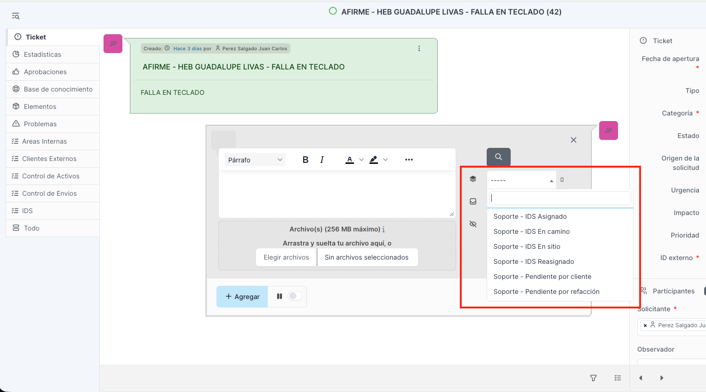
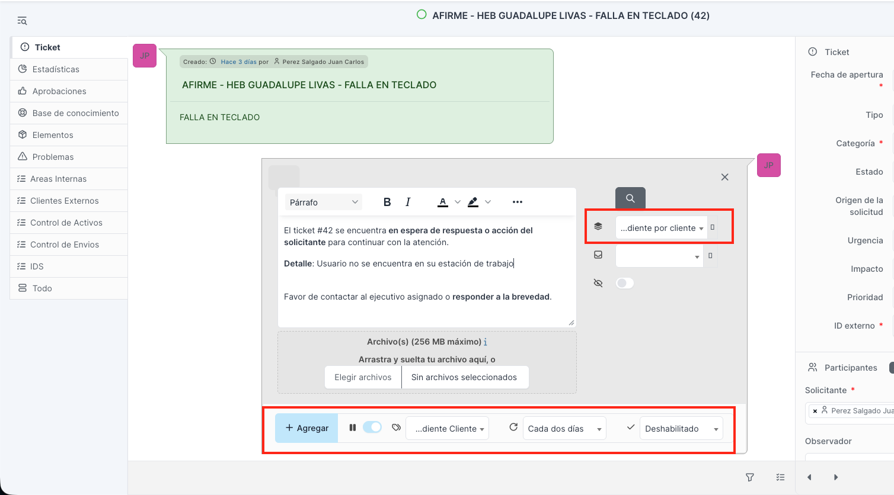
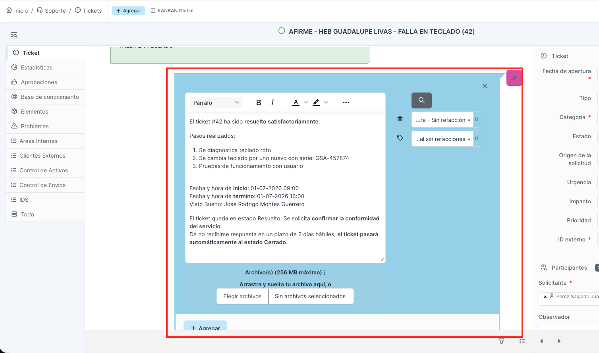

# Parte 4. Seguimiento de tickets
 
**Manual de Uso de GLPI para Agentes de Mesa de Ayuda**
Trantor Technologies | Service Desk
 
---
 
## 4.1 El agente MAC es el dueño del ticket
 
Registrar el ticket es solo el inicio. A partir de ahí, el agente MAC es el **responsable de mantenerlo actualizado** durante todo su ciclo de vida, hasta que el servicio se restablece y el ticket queda en Resuelto.
 
Reglas de propiedad (ownership) que no se negocian:
 
- **Un ticket nunca se queda sin actualización.** Cada avance, gestión o cambio se registra en el ticket. Si no está en el ticket, no sucedió.
- **No se acepta "no me han enviado la información".** El agente MAC no espera de forma pasiva: es su responsabilidad **solicitar la información directamente** a quien la tenga (coordinador, IDS, solicitante o cliente) y dejar constancia de cada gestión en el ticket.
- **Un ticket detenido sin seguimiento documentado es una falla de operación.** Si un caso está trabado, en el ticket debe verse qué se hizo para destrabarlo y a quién se contactó.
Esto es lo que da trazabilidad real: cualquiera que abra el ticket entiende en qué va, sin preguntar. Y protege el SLA, porque un ticket bien seguido se mueve; uno abandonado consume el tiempo sin avanzar.
 
---
 
## 4.2 Cómo documentar: plantillas de seguimiento
 
Para estandarizar las actualizaciones, GLPI tiene configuradas **plantillas de seguimiento**: textos predefinidos que el agente aplica para documentar cada momento del ticket de forma rápida y consistente. Traen variables automáticas (por ejemplo `{{ ticket.ref }}`, que inserta el número de ticket) y espacios `[__]` que el agente completa con el dato concreto.
 
### A qué categorías aplican
 
Según la configuración vigente, las plantillas de seguimiento aplican a:
 
- Todas las categorías de **Clientes Externos (OP > CE)**.
- **OP > AI > Sistemas Internos**.
Las demás categorías (Laboratorio, Documentación Interna y las de Administración) se documentan con **seguimientos de texto libre**, ya que no tienen plantillas configuradas.
 
### Plantillas vs. texto libre
 
La regla es usar la plantilla siempre que exista una que corresponda al momento del ticket: es más rápido y mantiene el registro uniforme. El texto libre se permite **solo cuando ninguna plantilla cubre lo que se necesita documentar**. No es un atajo para saltarse la plantilla, sino una salida para los casos que la plantilla no contempla.
 
---
 
## 4.3 Catálogo de plantillas
 
Las plantillas se agrupan en cuatro tipos según el momento del ticket que documentan. El tipo también determina **desde qué botón** se aplican, porque GLPI separa dos acciones:
 
- Botón **Responder**: muestra las plantillas de tipo **Seguimiento** y **Pendiente**. Es la vía normal para documentar avances y para poner un ticket en espera.
- Botón **Resolver**: muestra las plantillas de tipo **Resolución** y **Cancelación**. Es la vía para dar por terminado el ticket.
Por eso, antes de elegir la plantilla, el agente elige el botón según lo que va a hacer: actualizar o resolver.
 

 
| Momento (nombre en GLPI) | Tipo | Qué documenta | Datos a completar |
|---|---|---|---|
| Soporte - IDS Asignado | Seguimiento | El ticket fue asignado a un IDS. | Referencia del IDS. |
| Soporte - IDS Reasignado | Seguimiento | El ticket cambió de IDS. | Nuevo IDS. |
| Soporte - IDS En camino | Seguimiento | El IDS inició traslado a sitio. | Hora estimada de arribo, técnico. |
| Soporte - IDS En sitio | Seguimiento | El IDS llegó y arranca la atención. | Nombre del IDS, hora de llegada. |
| Soporte - Reprogramación (Temas internos) | Seguimiento | La atención se reprograma. | Nueva fecha y hora. |
| Soporte - Equipo / Servicio Diagnosticado | Seguimiento | Se concluyó el diagnóstico. | Diagnóstico realizado. |
| Soporte - Pendiente por cliente | Pendiente | El ticket espera respuesta o acción del solicitante. | Detalle de lo que se espera. |
| Soporte - Pendiente por refacción | Pendiente | El ticket espera refacciones para resolverse. | Refacciones requeridas. |
| Soporte - Resolución - Sin refacción | Resolución | El servicio se restableció sin refacción. | Pasos, inicio/término, visto bueno. |
| Soporte - Resolución - Con refacción | Resolución | El servicio se restableció usando refacciones. | Pasos, refacciones usadas, inicio/término, visto bueno. |
| Soporte - Resolución - Remota | Resolución | El servicio se resolvió de forma remota. | Modalidad, pasos, inicio/término, visto bueno. |
| Soporte - Resolución - Arbitraria | Resolución | Cierre a solicitud del cliente o por causa externa. | Motivo del cierre, quién lo solicita. |
| Soporte - Cancelación de ticket | Cancelación | El ticket se cancela. | Motivo y fecha de cancelación. |
 
> Buena práctica: al aplicar una plantilla, completar todos los `[__]`. Una plantilla aplicada a medias documenta menos que un buen texto libre.
 
---
 
## 4.4 Estado En espera y pausa del SLA (regla crítica)
 
Cuando un ticket debe detenerse porque depende de un tercero (el cliente no responde, falta una refacción), **no se marca el pendiente a mano**: se aplica la **plantilla de Pendiente** que corresponda.
 
- Soporte - Pendiente por cliente.
- Soporte - Pendiente por refacción.
Por qué importa: al aplicar una de estas plantillas, **GLPI pausa automáticamente el reloj del SLA**. Es decir, el tiempo deja de correr en contra mientras el ticket depende de algo externo. Este es el mecanismo correcto para poner un ticket En espera; hacerlo por fuera de la plantilla no pausa el reloj y el ticket seguiría consumiendo SLA sin necesidad.
 
Regla: para dejar un ticket En espera, siempre se usa la plantilla de Pendiente. Cuando se resuelve la dependencia, el ticket se reactiva y el reloj vuelve a correr.
 

 
> Recordatorio: aunque el reloj se pause, la propiedad del ticket no. El agente sigue siendo responsable de perseguir la respuesta del cliente o la llegada de la refacción, y de documentarlo.
 
---
 
## 4.5 Resolución y cierre
 
Cuando el servicio queda restablecido, el agente da por terminado el ticket con el botón **Resolver** (distinto del botón Responder) y aplica la **plantilla de Resolución** que corresponda: sin refacción, con refacción o remota. Con ello el ticket pasa a **Resuelto**.
 
- Las plantillas de resolución piden dejar constancia de los pasos realizados, las fechas de inicio y término y el visto bueno del usuario.
- El ticket en Resuelto solicita al solicitante confirmar la conformidad del servicio.
- **El agente resuelve, pero nunca cierra.** GLPI cierra el ticket de forma automática **a las 48 horas** de estar en Resuelto sin respuesta en contra. Resolver (dejar en Resuelto) es acción del agente; cerrar (pasar a Cerrado) lo hace el sistema.
 

 
### Cierre por cancelación
 
Cuando un caso ya no procede (cancelado por operación o porque el servicio dejó de requerirse), GLPI **no tiene un estado Cancelado**. La forma correcta de manejarlo es la misma acción de Resolver, pero aplicando la **plantilla de Cancelación de ticket**, que registra el motivo y la fecha. El ticket queda en Resuelto con esa plantilla y luego cierra automáticamente a las 48 horas.
 
La plantilla de **Resolución arbitraria** cubre el cierre a petición del cliente o por causa externa, y registra el motivo y quién lo solicita. También se aplica desde el botón Resolver.
 
---
 
## 4.6 Escalación durante el seguimiento
 
Si durante el seguimiento el nivel que atiende no responde o el ticket está en riesgo de incumplir su SLA, el agente escala. La escalación tiene tres niveles y **no se salta el orden**: se sube al siguiente solo cuando el anterior no respondió en un tiempo razonable.
 
- **Nivel 1:** el responsable directo del caso (para clientes externos dinámicos, el coordinador regional de la zona; para categorías con responsable fijo, esa persona).
- **Nivel 2:** el gerente o responsable superior que corresponde a la categoría.
- **Nivel 3:** la dirección correspondiente.
El detalle por categoría (quién es cada nivel) se concentra en el Anexo de escalación.
 
---
 
## 4.7 Resumen del ciclo en seguimiento
 
Recorrido típico de estados y qué los dispara:
 
| Estado | Cómo se llega | Acción del agente |
|---|---|---|
| En curso (asignada) | Al crear el ticket. | Registro inicial. |
| En curso (planificada) | El coordinador asignó IDS y hay fecha/hora. | Botón Responder + plantillas de IDS (asignado, en camino, en sitio). |
| En espera | El caso depende de cliente o refacción. | Botón Responder + plantilla de Pendiente (pausa el SLA). |
| Resuelto | El servicio quedó restablecido. | Botón Resolver + plantilla de Resolución (o Cancelación). |
| Cerrado | Automático a las 48 h en Resuelto. | Ninguna: GLPI cierra solo. |
 
Idea de cierre: el agente mueve el ticket documentando cada paso con la plantilla correcta. El estado no se cambia "en seco": se cambia dejando constancia de por qué cambió.
 
---
 
*Fin de la Parte 4. Seguimiento de tickets.*
 