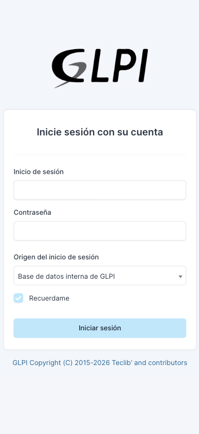
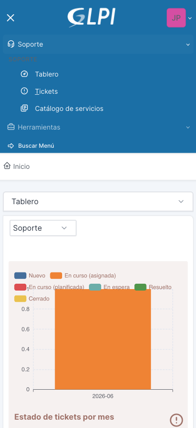
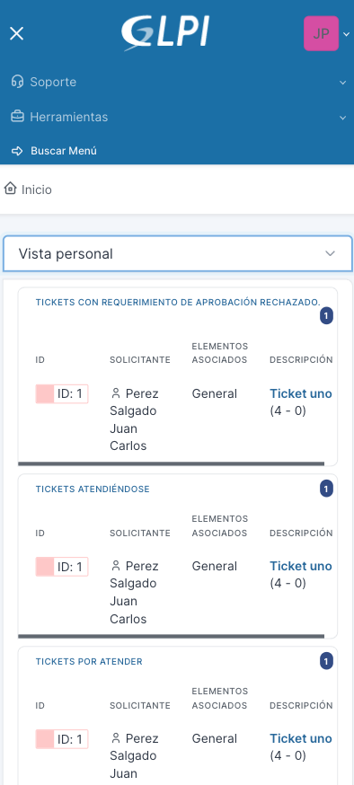
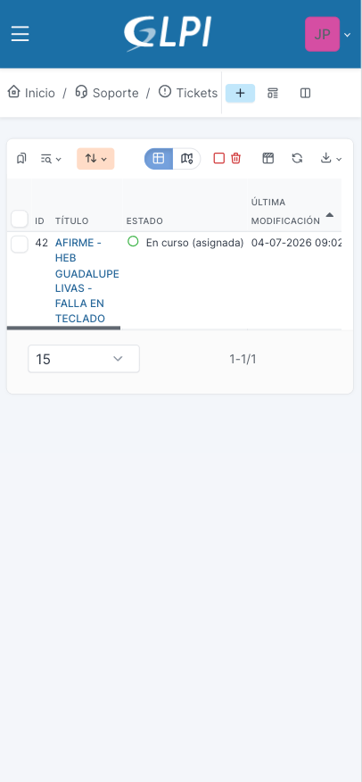

# Parte 2. Primeros pasos

**Manual de Uso de GLPI para IDS (Ingenieros de Servicio)**
Trantor Technologies | Service Desk

---

## 2.1 Cómo iniciar sesión

Ingresa desde: **https://helpdesk.trantortechnologies.mx**

Para ingresar, coloca tu correo y la contraseña que te haya confirmado el área de Sistemas, Recursos Humanos o tu coordinador.

Puedes acceder desde cualquier dispositivo con conexión a internet (celular, tablet o computadora). En campo, tu acceso principal será desde el celular.

Si olvidas tu contraseña o necesitas que te la restablezcan, no puedes hacerlo por tu cuenta. Contacta a Mesa de Ayuda Central o a tu coordinador para solicitar la recuperación ante el administrador de la plataforma.

## 2.2 Tu perfil en GLPI

Al iniciar sesión, tu perfil te muestra únicamente estas opciones:

- **Tablero**
- **Tickets**
- **Catálogo de servicios**
- **Base de conocimientos**

Este alcance es intencional: tu perfil está diseñado para enfocarte en tus tickets asignados, sin exponerte a módulos que no te corresponden. Dentro de Tickets, no puedes modificar la información general que capturó MAC, pero sí puedes agregar tus seguimientos con las plantillas correspondientes (esto se explica a detalle en la Parte 4).

## 2.3 Cómo llegar a tus tickets asignados

Tienes dos formas de ver tus tickets, dependiendo de qué necesites en el momento.

### Vista rápida: Tablero

Al entrar, la pantalla de **Inicio** te muestra el Tablero. Ahí, en la pestaña **Vista personal**, encuentras un resumen rápido de tus tickets: cuántos tienes abiertos, resueltos, desfasados o cerrados.

Esta vista es útil para tener un panorama general al iniciar tu jornada. Además de consultar el resumen, puedes dar clic sobre alguno de los indicadores para entrar directo al ticket correspondiente, sin necesidad de ir primero al listado completo.

### Vista de trabajo: Tickets

Para ver el listado completo de tus tickets asignados y trabajar sobre ellos, entra al menú **Soporte > Tickets**. Ahí ves directamente los tickets que te corresponden a ti, sin necesidad de aplicar ningún filtro adicional.

Esta es tu lista de trabajo diaria: es donde entras a cada ticket para revisar la información y registrar tus seguimientos.

---

*Fin de la Parte 2. Primeros pasos.*
