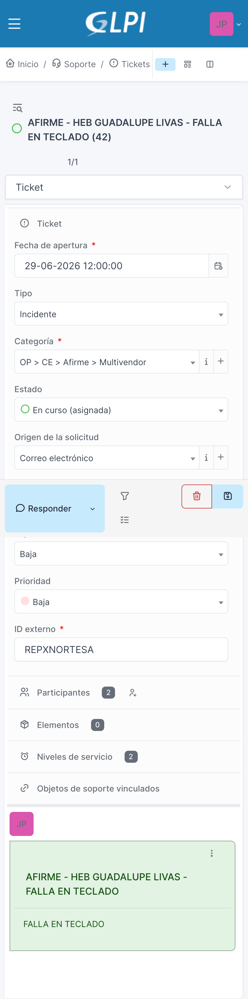
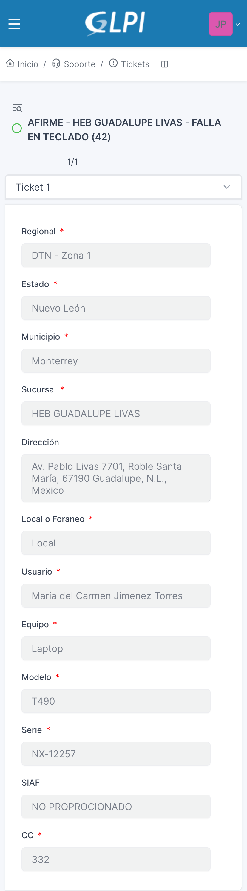

# Parte 3. Gestión de tickets: recepción y lectura

**Manual de Uso de GLPI para IDS (Ingenieros de Servicio)**
Trantor Technologies | Service Desk

---

## 3.1 Cómo te llega la asignación

Cuando tu coordinador te indica una actividad, esa indicación siempre debe estar reflejada en un ticket dentro de GLPI. Si la actividad no tiene ticket, no está documentada, y como ya vimos en la Parte 1, lo que no está en el ticket no sucedió.

Te enteras de una nueva asignación por dos vías, que normalmente ocurren juntas:

- **Tu coordinador te lo indica directamente** (llamada, mensaje u otro medio), y ese ticket ya debe existir o crearse en GLPI para dar seguimiento a esa actividad.
- **Recibes una notificación a tu correo institucional** cuando el ticket queda asignado a ti.

En ambos casos, el ticket en GLPI es la referencia oficial de la actividad. Aunque tu coordinador ya te haya adelantado el caso, siempre debes entrar al ticket antes de moverte a sitio: ahí está la información completa que necesitas para atender correctamente.

## 3.2 Cómo leer un ticket asignado

Al abrir un ticket, tómate el tiempo de revisar toda la información disponible, no solo el título o la descripción. Cada campo que capturó MAC te da contexto útil para tu atención:

- **Descripción:** qué reportó el usuario, qué falla o qué se solicita.
- **Prioridad:** qué tan rápido necesitas actuar y documentar.
- **Estado:** en qué etapa va el ticket.
- **Categoría:** el tipo de servicio que vas a atender.

Revisar bien esta información antes de trasladarte te evita llegar a sitio sin el contexto necesario, o descubrir hasta el momento de la atención un dato que ya estaba documentado en el ticket. También te da una idea clara de qué herramienta vas a necesitar para la atención, antes de salir.

## 3.3 Las tabs del ticket: información operativa para tu atención

Además de la información general, cada ticket tiene tabs adicionales con datos personalizados. Estas tabs las llena el equipo de MAC al registrar el ticket; tú no las modificas, pero sí debes consultarlas, porque ahí está la información concreta que necesitas para tu atención en sitio:

- **Dirección y ubicación:** a dónde debes trasladarte.
- **Usuario de contacto en sitio:** con quién debes presentarte al llegar (no siempre es la misma persona que solicitó el servicio).
- **Datos del equipo:** tipo, modelo, serie u otros identificadores, según el caso.

Ignorar estas tabs es una causa común de retrabajo: traslados a la dirección equivocada, presentarte con la persona que no es, o no saber con qué equipo vas a trabajar. Revisarlas es parte de tu preparación antes de salir a sitio.

---

*Fin de la Parte 3. Gestión de tickets: recepción y lectura.*
