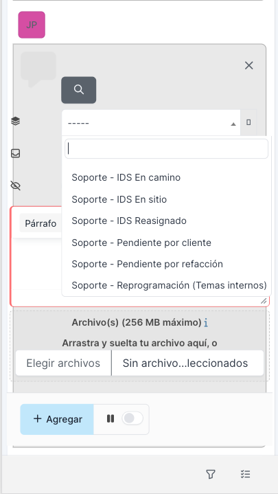
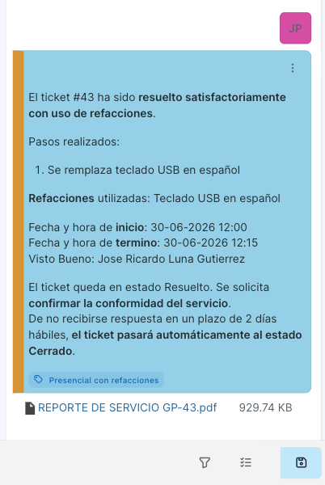
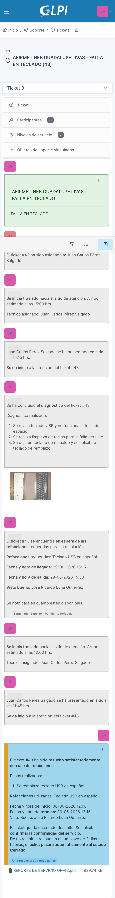

# Parte 4. Seguimiento y resolución de tickets

**Manual de Uso de GLPI para IDS (Ingenieros de Servicio)**
Trantor Technologies | Service Desk

---

## 4.1 Documentar en tiempo real, no al final

Documentar no es un resumen que haces al terminar el servicio. Cada etapa se registra en el momento en que ocurre: cuando sales, cuando llegas, cuando diagnosticas, cuando resuelves.

Dejar todo para documentarlo junto al final no es válido, aunque el servicio se haya resuelto correctamente. La operación necesita ver tu avance conforme sucede, no reconstruido después. Esto protege el SLA y le da a tu coordinador y a MAC visibilidad real de en qué momento vas.

Como mínimo, un ticket bien documentado debe tener, en este orden:

1. IDS En camino
2. IDS En sitio
3. Diagnosticado
4. Resolución (el tipo que corresponda)

Si el caso lo requiere, se agregan Pendiente por cliente o Pendiente por refacción entre el diagnóstico y la resolución.

## 4.2 Plantillas que utilizas

Documentas con las plantillas de seguimiento configuradas en GLPI. Debes usar siempre la plantilla que corresponda a la etapa; el texto libre solo se permite cuando ninguna plantilla cubre lo que necesitas documentar, y debe ser la excepción, no la costumbre.

| Plantilla | Cuándo la aplicas | Qué debes documentar |
|---|---|---|
| Soporte - IDS En camino | Cuando inicias tu traslado a sitio. | Hora estimada de llegada. |
| Soporte - IDS En sitio | Cuando llegas y arrancas la atención. | Hora de llegada. |
| Soporte - Equipo / Servicio Diagnosticado | Cuando concluyes tu diagnóstico. | El diagnóstico realizado, de forma específica. |
| Soporte - Pendiente por cliente | El ticket espera respuesta o acción del solicitante o usuario en sitio. | Qué específicamente esperas y de quién. |
| Soporte - Pendiente por refacción | El ticket espera una refacción para resolverse. | Qué refacción se requiere. |
| Soporte - Resolución (Sin refacción / Con refacción / Remota, según el caso) | El servicio quedó restablecido. | Pasos realizados, hora de inicio y término, y evidencia de conformidad. |

## 4.3 Botones Responder y Resolver

Tu perfil tiene ambos botones disponibles:

- **Responder:** para las plantillas de En camino, En sitio, Diagnosticado y Pendiente.
- **Resolver:** para las plantillas de Resolución.

Antes de elegir la plantilla, decide primero qué botón te corresponde según lo que vas a documentar: un avance (Responder) o el cierre de la atención (Resolver).

## 4.4 Sé específico al documentar

Una plantilla aplicada con información genérica documenta poco, aunque hayas usado la plantilla correcta. Al completar los espacios de cada plantilla, describe el dato real, no una frase general.

Ejemplo de lo que se espera en Diagnosticado:

- Incorrecto: "Se revisó el equipo y se encontró la falla."
- Correcto: "Se revisó impresora HP LaserJet, se detectó fusor dañado que impide el paso del papel. Se requiere reemplazo de fusor."

La misma lógica aplica para todas las plantillas: entre más concreto el dato, más útil es el registro para quien lea el ticket después.

## 4.5 Pendientes: cuándo y cómo

Si tu atención se detiene porque depende de algo externo, aplicas la plantilla de Pendiente que corresponda:

- **Pendiente por cliente:** cuando esperas una respuesta o una acción del usuario o del solicitante.
- **Pendiente por refacción:** cuando esperas una refacción para poder resolver.

Al aplicar cualquiera de estas plantillas, el sistema pausa automáticamente el reloj del SLA. Es la única forma correcta de dejar un ticket en espera: nunca se hace de forma manual o solo verbal con tu coordinador.

## 4.6 Resolución: formatos y evidencia

Cuando el servicio queda restablecido, aplicas la plantilla de Resolución que corresponda (Sin refacción, Con refacción o Remota) desde el botón Resolver.

Además de la plantilla, cada atención requiere que recabes en sitio los **formatos físicos de conformidad** correspondientes al tipo de servicio y al cliente. Tu coordinador te indica qué formato aplica en cada caso, ya que puede variar de cliente a cliente.

Reglas sobre estos formatos:

- Se digitalizan y se adjuntan directamente al ticket, ya sea al momento de resolver o inmediatamente después.
- Enviarlos a tu coordinador no sustituye adjuntarlos al ticket: deben estar en ambos lugares.
- Un ticket no se considera correctamente documentado hasta que el formato de conformidad está adjunto en GLPI.

Sobre evidencia fotográfica: se adjunta cuando aporta al caso (por ejemplo, una pieza dañada), con una o dos fotos suficientes. No se debe abusar de las imágenes ni subir evidencia de más.

## 4.7 Ejemplo de un ticket bien documentado

Para que veas cómo se ve un caso completo, aquí un ejemplo de principio a fin:

1. **IDS En camino:** "Salida de [nombre] hacia sitio, hora estimada de llegada 11:30 hrs."
2. **IDS En sitio:** "Llegada a sitio 11:25 hrs. Se contacta con [usuario de contacto]."
3. **Diagnosticado:** "Se revisó impresora HP LaserJet M404, se detectó fusor dañado que impide el paso del papel. Se requiere reemplazo de fusor."
4. **Pendiente por refacción** *(si aplica)*: "Se solicita fusor HP M404 a almacén. Sin esta refacción no se puede continuar."
5. **Resolución - Con refacción:** "Se sustituyó fusor dañado por refacción nueva. Se realizaron pruebas de impresión, equipo operando correctamente. Inicio 11:25 hrs, término 12:10 hrs. Formato de conformidad firmado por [usuario], adjunto al ticket."

Este orden y este nivel de detalle es lo que se espera en cada atención que documentas.

## 4.8 Escalación durante tu atención

Si en sitio te bloquea algo que no puedes resolver por tu cuenta (una refacción que no llega, un acceso que el cliente no autoriza, una instrucción que te falta), repórtalo a tu coordinador y déjalo documentado en el ticket. No te quedes con el problema sin avisar: escalar a tiempo es parte correcta de tu trabajo, y el ticket debe reflejar qué pasó y a quién se avisó.

---

*Fin de la Parte 4. Seguimiento y resolución de tickets.*
